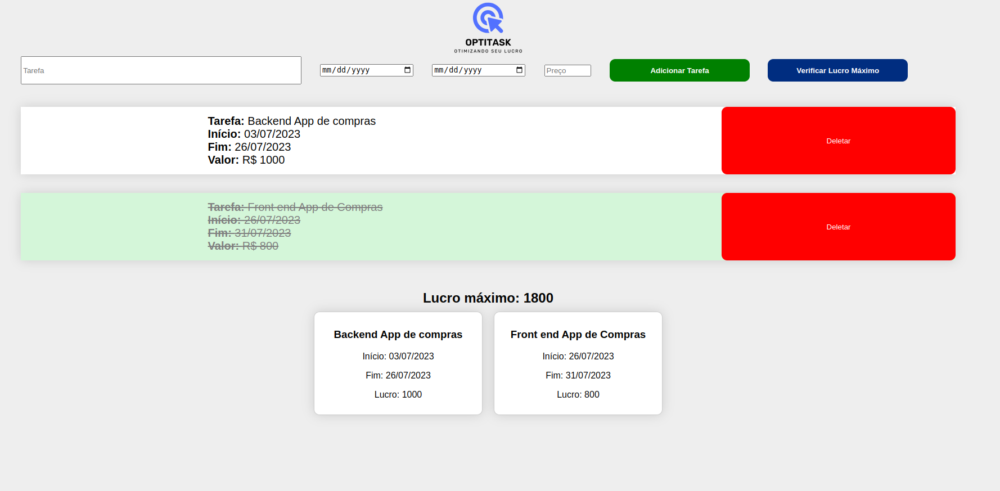

# OptiTask

**Número da Lista**: 12<br>
**Conteúdo da Disciplina**: PD <br>
## Alunos
|Matrícula | Aluno |
| -- | -- |
| 18/0119231  |  Eduardo Maia Rezende |
| 17/0107426  |  Kayro César Silva Machado |


## Sobre 
OptiTask é um projeto que tem por finalidade auxiliar o usuário a decidir quais tarefas deve realizar, baseado no lucro recebido por cada tarefa e sua data de realização. O usuário pode adicionar tarefas, definindo seu lucro e data de realização, e o sistema irá retornar a melhor combinação de tarefas que o usuário deve realizar para obter o maior lucro possível. É importante salientar que implementamos o algoritmo de Weighted Interval Scheduling com o intuito de maximizar o lucro em nosso projeto, assim o lucro é o equivalente ao peso do algoritmo original.


## Screenshots


## Video de Apresentação
[Assistir no Youtube](https://youtu.be/zKRxg0NQ0Lk)
> Disponível na raiz do repositório.

## Instalação 
**Linguagem**: Python & Javascript< br>
**Framework**: Flask<br>

- Dependências:
  - Flask


### Passo 1:
 Caso não possua as dependências descritas acima, instale-as na pasta raiz do projeto utilizando comando abaixo:
```sh
pip3 install -r requirements.txt
```
### Passo 2:
Entre na pasta **src** do projeto e execute o arquivo principal  com o comando abaixo:
```
python3 app.py
```

## Uso

Acesse a porta 5000 a partir do link [http://127.0.0.1:5000/](http://127.0.0.1:5000/), Adicione as tarefas que deseja realizar, definindo seu lucro e data de realização, e clique em "Verificar Lucro Máximo" para obter a melhor combinação de tarefas que o usuário deve realizar para obter o maior lucro possível.


